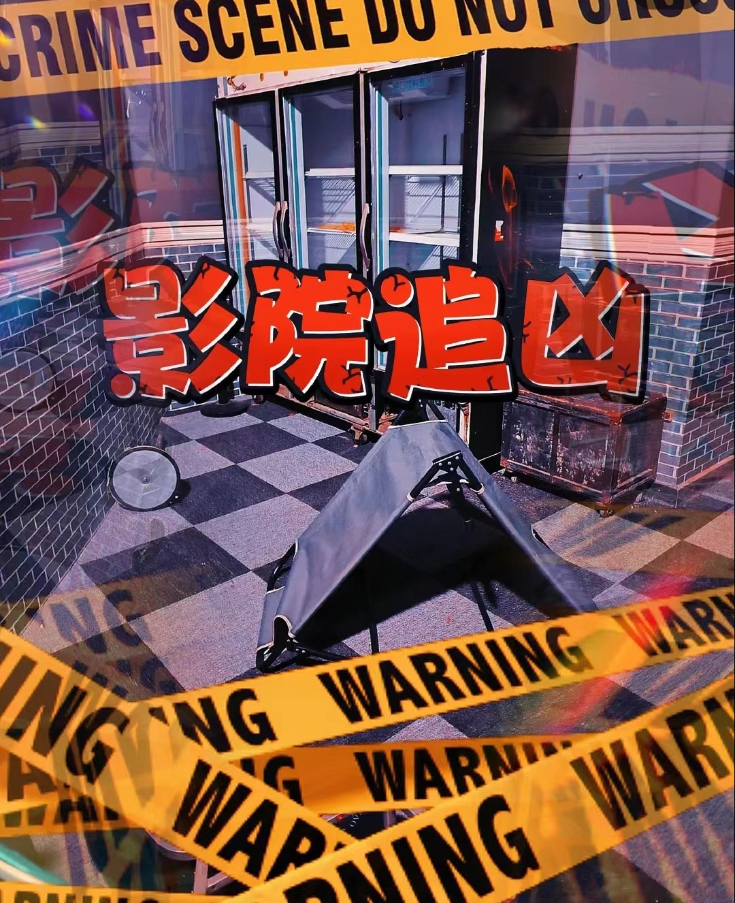

# 鲸娱秘境-实景AI游戏

李鲁鲁老师指导的鲸娱秘境队伍在Intel2025创新大赛中的提交，鲸娱秘境是刘济帆经营的在北京望京的AI线下实体密室逃脱


<div style="display: flex; align-items: center;">
  <div style="flex: 0 0 300px;">
    
  </div>
  <div style="flex: 1; padding-left: 20px;">
    <!-- 在这里添加右侧文本内容 -->
    鲸娱密境AI实景游戏，是由清华-中戏跨学科团队打造的沉浸式娱乐解决方案。项目基于生成式AI技术，通过智能体（AIAgent）重构传统的线下密室与剧本杀产业，已在实际商业场景实现4000+玩家验证。我们试图使用最新的语言模型技术以及创新的运营模式，解决行业痛点：内容生产成本高、人力运营成本高、空间利用率低。鲸娱密境在游戏流程中，使用大量的角色扮演Agent，来代替玩家阅读剧本的方式，向玩家提供信息。
  </div>
</div>

<details>
<summary>demo开发者: 李鲁鲁, 王莹莹, sirly(黄泓森), 刘济帆</summary>
- 李鲁鲁负责了gradio大部分的交互和api连接
- 王莹莹实现了从vlm中抽取物体 并且根据物体生成角色台词
- 刘济帆提供了角色的剧情设计
- Sirly完成了OpenVINO的部署
</details>

# 原型项目的动机


https://github.com/user-attachments/assets/e2b707b6-dcdf-44de-b43d-e6765945ac38


在传统的线下密室中，往往需要玩家通过将特定的物品放到特定的位置来推动剧情。这时如果使用射频装置来进行验证，玩家往往会摸索检查道具中RFID的芯片以及寻找芯片的感应区，这一行为会造成严重的“出戏”。并且，对于错误的道具感应，往往由于主题设计的人力原因，没有过多的反馈。而如果使用人力来进行检验，往往会极大程度地拉高密室的运营成本。在这次比赛的项目中，我们希望借助VLM的泛化能力，能够实现对任意场景中的物品都能够触发对应的反馈。并且，当玩家将任意场景中的物品展示到场景区域的时候，会先由VLM确定物品，然后再触发对应的AIGC的文本。如果物品命中剧情需要的物品列表时，则会进一步推进剧情。借助语言模型的多样化文本的生成能力，可以为场景中的所有道具，都设计匹配的感应语音，以增加游戏的趣味性。项目计划最终也支持在具有OpenVINO的Intel AIPC上运行，以期待可以最终以较小的终端设备形式，加入到实际运营的线下场馆中。


# 运行说明

在运行之前需要参照.env.example的方式部署.env，对于在线端可以这么设置

```bash
LLM_BACKEND = zhipu
MODEL_NAME = glm-4-air
```

对于使用openvino本地模型的，使用"openvino"，并且需要设置模型名称，在提交视频中使用了Qwen2.5-7B-Instruct-fp16-ov。同时你需要在本地建立openai形式的fastapi，使用8000端口。


```bash
LLM_BACKEND = openvino
MODEL_NAME = Qwen2.5-7B-Instruct-fp16-ov
```

同时LLM_BACKEND额外还支持openai和siliconflow


# 使用VLM和显式COT对广泛物体进行识别

在剧本杀场景中，物品识别的挑战在于需要处理高度多样化的物品类型——包括剧情相关的关键道具、环境装饰物品以及玩家携带的意外物品（如手机、个人配饰等）。为解决这一问题，我们创新性地采用了视觉语言模型（VLM）结合显式思维链（Chain-of-Thought, CoT）的技术方案，其核心设计如下：

1. **覆盖长尾物品**：传统CV模型难以覆盖剧本杀中可能出现的非常规物品（如"会员登记表"、"烟头"、"双节棍"等）
2. **语义灵活性**：同一物品可能有多种名称（如"会员卡" vs "VIP卡"），需要动态匹配候选词
3. **推理可解释性**：通过显式CoT确保模型决策过程透明可追溯

我们的核心prompt设计如下

```
请帮助我抽取图片中的主要物体，如果命中candidates中的物品，则按照candidates输出，否则，输出主要物品的名字
candidates: {candidates}
Let's think step by step and output in json format, 包括以下字段:
- caption 详细描述图像
- major_object 物品名称
- echo 重复字符串: 我将检查candidates中的物品，如果major_object有同义词在candidates中，则修正为candidate对应的名字，不然则保留major_object
- fixed_object_name: 检查candidates后修正（如果命中）的名词，如果不命中则重复输出major_object
```

这一段核心代码部分在src/recognize.py中。

# 使用显式COT对特定物品的台词生成

我们也使用一个显示的CoT，来对特定物品的台词进行生成。

这部分在GameMaster.py的generate_item_response函数中。具体使用了这样一个prompt

```
该游戏阶段的背景设定:{background}
对于道具 {item_i} 的回复是 {response_i}

你的剧情设定如下: {current_prompt}

Let's think it step-by-step and output into JSON format，包括下列关键字
    "item_name" - 要针对输出的物品名称{item_name}
    "analysis" - 结合剧情判断剧情中的人物应该进行怎样的输出
    "echo" - 重复下列字符串: 我认为在剧情设定的人物眼里，看到物品 {item_name}时，会说
    "character_response" - 根据人物性格和剧情设定，输出人物对物品 {item_name} 的反应
```

比如当物品输入手机的时候，LLM的回复为

```json
{
  "item_name": "手机",
  "analysis": "在剧情中，手机作为一个可能的线索，可能会含有凶手的通讯记录或者与受害者最后的联系信息。队长李伟会指示队员们检查手机，以寻找可能的线索，如通话记录、短信、社
交媒体应用等。",
  "echo": "我认为在剧情设定的人物眼里，看到物品 手机时，会说",
  "character_response": "队长李伟可能会说：'这手机可能是死者最后的通讯工具，检查一下有没有未接电话或者最近的通话记录，看看能否找到凶手的线索。'"
}
```


# 鲸娱秘境

**鲸娱秘境·现实游戏**  地址：酒仙桥路新辰里3楼（米瑞酷影城旁）

【鲸娱秘境·现实游戏】成立于2023年5月，团队致力于将游戏与真实场景结合，利用AIGC技术，打造出在现实中完全沉浸的游戏体验。


不同于传统密室或沉浸式体验的封闭空间，鲸娱秘境的每个主题都拥有开放的实景地图。例如在《影院追凶》游戏中，玩家需要进入真实的电影院里寻找线索，走访附近商家。《朝阳浮生记》则把商战搬到整层商场，商场里的每个商户都是NPC，玩家要在真实商场里买地、炒股、斗智斗勇。



此外，我们还利用各类AI技术增强游戏的沉浸感：比如让AI扮演证人与玩家进行对话，通过视觉模型分析玩家的动作并及时给出反馈，推动剧情发展。


这种 “现实游戏” 的设计，让玩家在自由探索中获得更加真实、沉浸的体验。


## Detailed TODO

本项目的开发成员在开源社区招募，下面的TODO记录了每个人的贡献

- [x] DONE by 鲁叔, 参考了王莹莹的原始代码 调通一个openai形式的response
- [x] (DONE by 鲁叔) 在gamemaster引入config配置(一个gamemaster载入一个yaml文件)
- [x] (DONE by 鲁叔) 准备一堆物品照片，确定gamemaster的物品载入格式
- [x] (DONE by 鲁叔) gradio和GM增加图片上传接口
- [x] 鲁叔, 完成剧情内物体 调试物品在chatbot的submit功能
- [x] 剧情外物体在chatbot的submit
- [x] (DONE by 鲁叔)在yaml中定义物品-台词的对应关系
- [x] 鲁叔 fix prompt， 鲁叔 fix解析 DONE by 王莹莹 实现根据prompt 物品 生成台词的函数
- [x](DONE by 鲁叔) 接通chat history - 鲁叔
- [x] (DONE by 王莹莹， 鲁叔fix 输入type) VLM接口识别物体
- [x] 调通语音生成
- [x] (DONE by sirly) ， 调通OpenVINO后端LLM对接
- [x] (DONE by sirly) ， 调通OpenVINO后端VLM对接
- [ ] (DONE by sirly) ， 部署gradio到魔搭和hugging face
- [x] (Done by 鲁叔) 装修界面
- [ ] 每个阶段都可以看到所有物品，感觉有点乱，我们可以限制每个阶段看到的物品不一样
- [ ] 目前每个物品的台词暂时是单一的 不受到阶段的控制, 可以之后升级定义为 支持某个阶段 某个物品的台词（单阶段响应）

